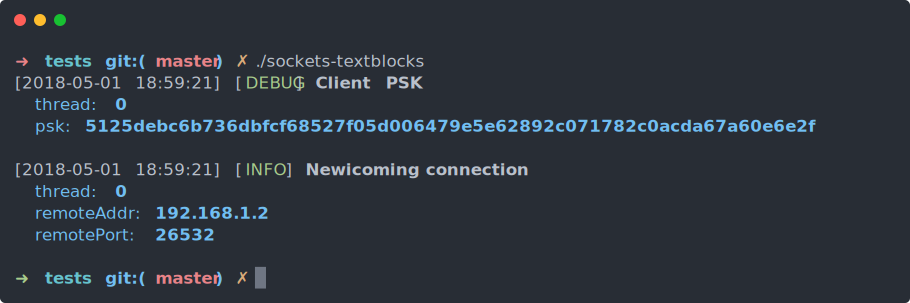
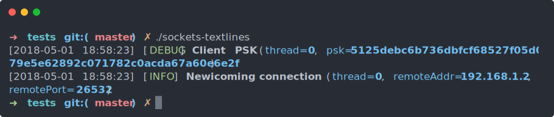
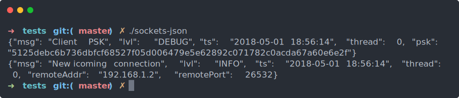

nim-chronicles
==============

[](https://travis-ci.org/status-im/nim-chronicles)
[](https://opensource.org/licenses/Apache-2.0)
[](https://opensource.org/licenses/MIT)

```
nimble install chronicles
```

> At the moment, Chronicles requires a recent devel version of Nim.

## Introduction

Chronicles is a library for structured logging. It adheres to the philosophy
that log files shouldn't be based on formatted text strings, but rather on
well-defined event records with arbitrary properties that are easy to read
for both humans and machines. Let's illustrate this with an example:

``` nim
import net, chronicles

socket.accept(...)
...
debug "Client PSK", psk = client.getPskIdentity
info "New incoming connection", remoteAddr = ip, remotePort = port

```

Here, `debug` and `info` are logging statements, corresponding to different
severity levels. You can think of their first argument as the name of a
particular event that happened during the execution of the program, while
the rest of the arguments are the properties of this event.

From these logging statements, Chronicles can be configured to produce log
output in various structured formats. The default format is called `textblocks`
and it looks like this:



Alternatively, you can use another human-readable format called `textlines`:



While these human-readable formats provide a more traditional and familiar
experience of using a logging library, the true power of Chronicles is
unlocked only after switching to the `JSON` format. Then, the same log output
will look like this:



At first, switching to JSON may look like a daunting proposition, but
Chronicles provides a customized log tailing program called `chronicles-tail`
which is able to transform the JSON stream back into the familiar human-readable
form, while also providing additional advanced features such as on on-the-fly
filtering, sound alerts and more.

The main advantage of using JSON logging is that this facilitates the storage
of the log records in specialized databases which are usually able to provide
search and filtering capabilities and allow you to compute various aggregated
metrics and time-series data from the accumulated logs.

Typical log storage choices for the above are open-source search engines such
as [ElasticSearch][1] or specialized providers such as [Loggly][2].

[1]: https://www.elastic.co/
[2]: https://www.loggly.com/

## Logging Scopes

In the introduction, we saw `debug` and `info` as examples for logging
statements. Other similar statements include `notice`, `warn`, `error`
and `fatal`. All of these statements accept arbitrary key-value pairs.
As a short-cut, you are also allowed to specify only the name of a particular
variable and Chronicles will create a key with the same name (i.e. passing
a local variable named `foo` will be translated to the pair `foo = foo`).

A common practice enforced in other logging libraries is to associate
the logging records with the name of the component that produced them
or with a particular run-time property such as `RequestID`. Chronicles
provides two general-purpose facilities for assigning such properties
in an automated way:

### `logScope`

`logScope` can be used to introduce additional properties that will be
automatically attached to all logging statements in the current lexical
scope:

``` nim
logScope:
  # Lexical properties are typically assigned to a constant:
  topics = "rendering opengl"

  # But you can also assign an expression that will be
  # evaluated on every log statement:
  memoryUsage = currentMemUsage()

proc renderFrame(...) =
  inc frameCounter

  logScope:
    # You can add additional properties in any scope. Only logging
    # statements that are in the same lexical scope will be affected:
    frame = frameCounter

  var t = startTimer()
  debug "Frame started"

  ...

  glFinish()
  debug "Frame finished", totalPrimitives, frameTime = t.elapsed
```

A `logScope` is usually put near the top of a Nim module and used to
specify statically assigned properties such as message origin, component
name, etc. The special `topics` property demonstrated here is important
for the log filtering mechanism, which will be explained in more details
later.

### `publicLogScope`

While a `logScope` affects only the current module, a `publicLogScope`
allows you to specify a set of custom properties that may affect your
entire program. For example, if you have an application running in a
server cluster, you may want to assign a property such as `serverId`
to every record. To achieve this, create a proxy logging module
importing `chronicles` and setting up a `publicLogScope`:

``` nim
# logging.nim

import chronicles

proc getServerId*()

publicLogScope:
  serverId = getServerId()

```

Every other module importing the proxy module will be able to use the
entire Chronicles API and will be affected by the public scope.
In fact, you should not import `chronicles` from such modules, because
this will lead to ambiguous symbols such as `activeChroniclesScope` and
`activeChroniclesStream`.

Using Nim's `--import:` option may be a good way to enforce the use of
the proxy module in your entire program.

### `dynamicLogScope`

A `dynamicLogScope` is a construct accepting a block of code that can be
used to attach properties to all logging statements that will be executed
anywhere within the tree of calls originating from the said block. The key
difference with the lexically bound properties is that this includes
logging statements from other modules, which are not within the lexical
scope of the `dynamicLogScope` statement.

If you still find the distinction between lexical and dynamic scopes confusing,
reading the following explanation may help you:

http://wiki.c2.com/?DynamicScoping

A dynamic scope is usually used to track the reason why a particular
library function is being called (e.g. you are opening a file as a result
of a particular network request):

``` nim
proc onNewRequest(req: Request) =
  inc reqID
  info "request received", reqID, origin = req.remoteAddress
  dynamicLogScope(reqID):
    # All logging statements triggered before the current block returns
    # will feature the reqID property. This includes logging statements
    # from other modules.
    handleRequest(req)
```

Just like regular log statements, `dynamicLogScope` accepts a list of arbitrary
key-value pairs. The use of `reqID` in the example above is a convenient short
form for specifying the pair `reqID = reqID`.

While the properties associated with lexical scopes are lazily evaluated as
previously demonstrated, all expressions at the beginning of a dynamic scope
will be eagerly evaluated before the block is entered.

## Compile-Time Configuration

Almost everything about Chronicles in configured at compile-time, through the
mechanism of Nim's `-d:` flags. For example, you can completely remove all of
the code related to logging by simply setting `chronicles_enabled` to `off`:

```
nim c -d:chronicles_enabled=off myprogram.nim
```

Chronicles comes with a very reasonable default configuration, but let's look
at some of the other supported options:

### chronicles_sinks

Chronicles supports producing log records in multiple formats and writing
those to various destinations such as the std streams, the system's syslog
daemon, or to one or more log files.

The combination of a log format and one or more associated log destinations
is called a 'sink'. You can use the `chronicles_sinks` option to provide the
list of sinks that will be used in your program.

The sinks are specified as a comma-separated list of valid Nim expressions
that will be better illustrated by the following examples:

- `json`

  Write JSON-records to stdout

- `json[file]`

  Write JSON-records to a file in the current directory named after the
  application itself.

- `textblocks[stdout,file(/var/log/myapp.log)]`

  Use the 'textblocks' format and send the output both to stdout and
  to a file with an absolute path /var/log/myapp.log

- `textlines[notimestamps,file(myapp.txt),syslog]`

  Use the 'textlines' format, but don't include timestamps and write
  both to a file named 'myapp.txt' with a relative path to the current
  working directory and also to syslog.

- `textlines[nocolors],json[file(logs/myapp.json,truncate)]`

  Send the output both in the 'textlines' format to stdout (but without
  using colors) and to a JSON file named myapp.json in the relative
  directory 'logs'. The  myapp.json file will be truncated on each
  program execution.

The built-in formats include `json`, `textlines` and `textblocks`, which
support options for specifying the use of colors and timestamps (for more
info see `chronicles_colors` and `chronicles_timestamps`).

The possible log destinations are `stdout`, `stderr`, `file` and `syslog`.

Please note that Chronicles also allows you to implement custom logging
formats through the use of the `customLogStream` facility.

### chronicles_streams

While having multiple log sinks enables you to record the same stream of
events in multiple formats and destinations, `chronicles_streams` allows
you to define additional independent streams of events identified by their
name. In the code, each logging statement is associated with exactly one
log stream, which in turn has an associated list of sinks.

The syntax for defining streams closely resembles the syntax for defining
sinks:

- `textlog[textlines],transactions[json[file(transactions.json)]]`

This will create two streams, called `textlog` and `transactions`.
The former will be considered the default stream associated with unqualified
logging statements, but each of the streams will exist as a separate symbol
in the code, supporting the full set of logging operations:

``` nim
textlog.debug "about to create a transaction"
transactions.info "transaction created", buyer = alice, seller = bob
```

The streams created through `chronicles_streams` will be exported by the
`chronicles` module itself, but you can also introduce additional streams
in your own modules by using the helpers `logStream` and `customLogStream`.

### chronicles_enabled_topics

All logging statements may be associated with a statically known list of
topics. Usually, this is done by specifying the `topics` property in a
particular `logScope`, but you can also specify it for individual log
statements.

You can use the `chronicles_enabled_topics` option to specify the list of
topics for which the logging statements should produce output. All other
logging statements will be erased at compile-time from the final code.
When the list includes multiple topics, any of them is considered a match.

> In both contexts, the list of topics is written as a comma or space-separated
string of case-sensitive topic names.

### chronicles_required_topics

Similar to `chronicles_enabled_topics`, but requires the logging statements
to have all of the topics specified in this list.

### chronicles_disabled_topics

The dual of `chronicles_enabled_topics`. This option specifies a black-list
of topics for which the associated logging statements should be erased from
the program.

### chronicles_log_level

This option can be used to erase at compile-time all log statements, not
matching the specified minimum log level.

Possible values are 'DEBUG', 'INFO', 'NOTICE', 'WARN', 'ERROR', 'FATAL',
and 'NONE'. The default value is 'DEBUG' in debug builds and `INFO` in
release mode.

### chronicles_runtime_filtering

This option enables the run-filtering capabilities of Chronicles.
The run-time filtering is controlled through the procs `setLogLevel`
and `setTopicState`:

```nim
type LogLevel = enum
  DEBUG, INFO, NOTICE, WARN, ERROR, FATAL, NONE

proc setLogLevel*(level: LogLevel)

type TopicState = enum
  Normal, Enabled, Required, Disabled

proc setTopicState*(topicName: string, state: TopicState): bool
```

The option is disabled by default because we recommend filtering the
log output in a tailing program. This allows you to still look at all
logged events in case this becomes necessary. Set the option to `on`
to enable it.

### chronicles_timestamps

This option controls the use of timestamps in the log output.
Possible values are:

- `RfcTime` (used by default)

  Chronicles will use the human-readable format specified in
  RFC 3339: Date and Time on the Internet: Timestamps

  https://tools.ietf.org/html/rfc3339

- `UnixTime`

  Chronicles will write a single float value for the number
  of seconds since the "Unix epoch"

  https://en.wikipedia.org/wiki/Unix_time

- `None` or `NoTimestamps`

  Chronicles will not include timestamps in the log output.

Please note that the timestamp format can also be specified
for individual sinks (see `chronicles_sinks`).

### chronicles_colors

This option controls the default color scheme used by Chronicles for
its human-readable text formats when sent to the standard output streams.

Possible values are:

- `AnsiColors` (used by default)

  Output suitable for terminals supporting the standard ANSI escape codes:
  https://en.wikipedia.org/wiki/ANSI_escape_code

  This includes most terminal emulators on modern Unix-like systems,
  Windows console replacements such as ConEmu, and the native Console
  and PowerShell applications on Windows 10.

- `NativeColors` (affects Windows only)

  In this mode, Windows builds will produce output suitable for the console
  application in older versions of Windows. On Unix-like systems, ANSI codes
  are still used.

- `None` or `NoColors`

  Chronicles will produce color-less output. Please note that this is the
  default mode for sinks logging only to files or for sinks using the json
  format.

Current known limitations:

- Chronicles will not try to detect if the standard outputs
  of the program are being redirected to another program or a file.
  It's typical for the colored output to be disabled in such circumstances.
  ([issue][ISSUE1])

[ISSUE1]: https://github.com/status-im/nim-chronicles/issues/1

### chronicles_indent

This option sets the desired number of spaces that Chronicles should
use as indentation in the `textblocks` format.

-----------------

All of the discussed options are case-insensitive and accept a number of
truthy and falsy values such as `on`, `off`, `true`, `false`, `0`, `1`,
`yes`, `no` or `none`.

## Custom Log Streams

### `logStream`

As an alternative to specifying multiple output streams with the
`chronicles_streams` option, you can also introduce additional
streams within the code of your program. A typical way to do this
would be to introduce a proxy module that imports and re-exports
`chronicles` while adding additional streams with `logStream`:

``` nim
import chronicles
export chronicles

logStream transactions[json[file(transactions.json)]]
```

The expression expected by `logStream` has exactly the same format
as the compile-time option and produces the same effect. In this particular
example, it will create a new stream called `transactions` that will be sent
to a JSON file named `transactions.json`.

After importing the proxy module, you'll be able to create records with any
of the logging statements in the usual way:

``` nim
import transactions_log

...

transactions.error "payment gateway time-out", orderId,
                    networkStatus = obtainNetworkStatus()
```

### `customLogStream`

`customLogStream` enables you to implement arbitrary log formats and
destinations.

Each logging statement is translated to a set of calls operating over
a structure called "Log Record" (with one instance created per logging
statement). New log formats can be implemented by defining a suitable
log record type. Let's demonstrate this by implementing a simple XML logger:

``` nim
import xmldom, chronicles

type XmlRecord[Output] = object
  output: Output

template initLogRecord*(r: var XmlRecord, lvl: LogLevel, name: string) =
  r.output.append "<event name=\"", escapeXml(name), "\" severity=\"", $lvl, "\">\n"

template setProperty*(r: var XmlRecord, key: string, val: auto) =
  r.output.append textBlockIndent, "<", key, ">", escapeXml($val), "</", key, ">\n"

template setFirstProperty*(r: var XmlRecord, key: string, val: auto) =
  r.setProperty key, val

template flushRecord*(r: var XmlRecord) =
  r.output.append "</event>\n"
  r.output.flushOutput

customLogStream xmlout[XmlRecord[StdOutOutput]]

publicLogScope:
  stream = xmlout

info "New Video", franchise = "Tom & Jerry", episode = "Smarty Cat"
```

The produced output from the example will be:

``` xml
<event name="New Video" severity="INFO">
  <thread>0</thread>
  <episode>Smarty Cat</episode>
  <franchise>Tom &amp; Jerry</franchise>
</event>
```

As you can see, `customLogStream` looks similar to a regular `logStream`,
but it expects a log record type as its only argument.

The record type is implemented by providing suitable definitons for
`initLogRecord`, `setFirstProperty`, `setProperty` and `flushRecord`.
We recommend defining these operations as templates because this will
facilitate the aggressive constant-folding employed by Chronicles (discussed
in more details in the next section). We also recommend making your log
record types parametric on an `Output` type, because this will allow the
users of the code to specify any of the output types defined in Chronicles
itself (see the module `log_output` for a list of those).

As demonstrated in the example above, you can set the `stream` property in
a Chronicles lexical scope to redirect all unqualified log statements to a
particular default stream.

## Cost of Abstractions and Implementation Details

Chronicles makes use of advanced compile-time programming techniques to
produce very efficient run-time code with minimal footprint.

The properties from lexical scopes are merged at compile-time with the
log statement arguments and if any constant variables are about to be
sent to the log output, they will be first concatenated by the compiler
in order to issue the minimum number of `write` operations possible.

The dynamic scopes store their run-time bindings on the stack, in special
frame structures forming a linked list. This list is traversed on each log
statement and each active property leads to one dynamically dispatched call.

To support constant-time topic filtering and property overriding in dynamic
scopes, Chronicles consumes a large amount of thread-local memory, roughly
proportional to the number of unique topic names and property names used
in the program.

## Future Directions

At the moment, Chronicles intentionally omits certain features expected
from a logging library such as log rotation and archival. We recommend
following the guidelines set in the [12-factor app methodology][12F-LOGS]
and sending your log output to `stdout`. It should be the responsibility
of the supervising daemon of the app to implement log rotation and archival.

We understand that certain users would want to take advantage of the
file sinks provided by Chronicles and these users may benefit from the
aforementioned features. If the Nim community provides a package for
a low-level abstraction of an automatically rotated and archived log
file, Chronicles will provide options for using it.

[12F-LOGS]: https://12factor.net/logs

## Contributing

The development of Chronicles is Sponsored by [Status.im](https://status.im/)
through the [OpenBounty](https://openbounty.status.im/) initiative. Please
take a look at our tracker for any issues having the [bounty][Bounties] tag.

When submitting pull requests, please add test cases for any new features
or fixes and make sure `nimble test` is still able to execute the entire
test suite successfully.

[Bounties]: https://github.com/status-im/nim-chronicles/issues?q=is%3Aissue+is%3Aopen+label%3Abounty

## License

Licensed at your option under either of:

 * Apache License, Version 2.0, ([LICENSE-APACHE](LICENSE-APACHE) or http://www.apache.org/licenses/LICENSE-2.0)
 * MIT license ([LICENSE-MIT](LICENSE-MIT) or http://opensource.org/licenses/MIT)
